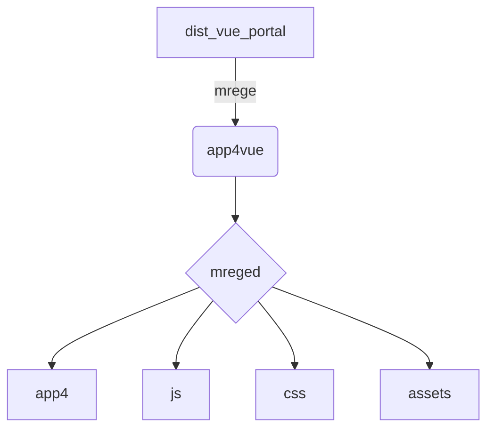

# vue-Tmenu
基于single-spa搭建的可拆卸的项目集成.

# usage

>install app4vue
```bash
cd app4vue

yarn

or

npm install


```

>install vue_protal
```bash
cd vue_protal

yarn

or

npm install
```

# single usage

>app4vue
```bash
yarn watch:standalone
```

>vue_protal
```bash
yarn serve
```

# integration usage

>app4vue
```bash
yarn watch:protal
```

```mk
  App running at:
  - Local:   http://localhost:9004/
  - Network: http://192.168.0.100:9004/
```

>vue_protal
```bash
yarn serve:integ
```

```mk
  App running at:
  - Local:   http://localhost:9000/
  - Network: http://192.168.0.100:9000/
```

##### Now you can visit [http://localhost:9000/](http://localhost:9000/)

# build
if you want to build this project
you should marge `vue_protal` and `app4vue` in same dir


